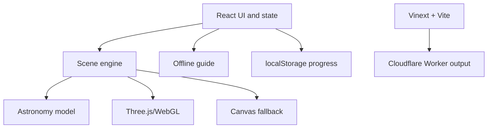
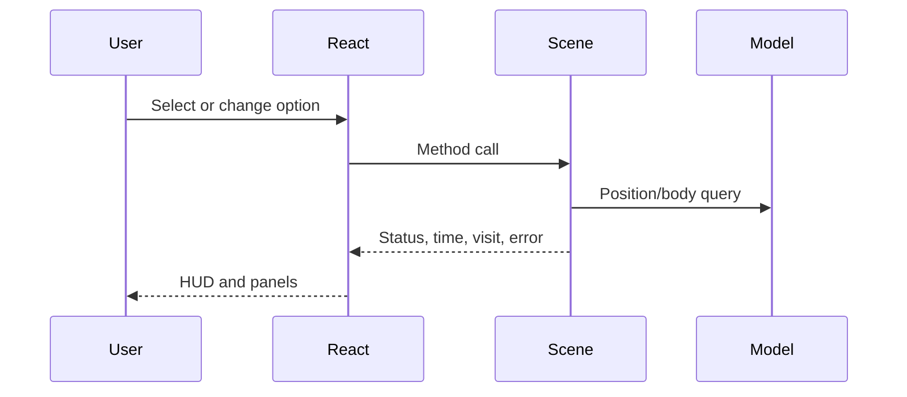

# Solar System Explorer — Architecture

## Scope

This document explains the current V1.1 implementation. Future aspirations belong in [MASTER_SPEC.md](MASTER_SPEC.md); scientific detail belongs in [ASTRONOMY_DATA.md](ASTRONOMY_DATA.md).

## System overview

Solar System Explorer is currently a client-focused React application with an imperative simulation/rendering engine behind a responsive HUD. It has no active application database, authentication, analytics, paid API, or server-side product API.

## Frontend architecture

### React interface

`app/page.tsx` is the main client component. It owns:

- selected body;
- readiness, renderer compatibility, status, errors, and displayed time;
- active sheet/search state;
- view/simulation options;
- distance-comparison selection;
- guide question/answer state;
- visited-world hydration and persistence.

It creates the scene engine once after mounting the canvas host and communicates through method calls and callbacks. High-frequency frame state stays outside React.

Existing Shadcn-derived primitives provide sheets, command search, selects, and switches. `app/globals.css` provides the product-specific HUD and responsive behavior.

### Scene adapter boundary

`createScene()` in `app/scene.ts` receives callbacks for selected body, flight/status text, simulation time, visited body, and recoverable scene errors.

It returns an imperative API: `focus`, `preload`, `overview`, `brake`, `setMovement`, `setOptions`, and `dispose`. Preserve this React/engine boundary unless a demonstrated limitation requires change.

## 3D and rendering architecture

### WebGL path

The engine attempts WebGL2, then WebGL. When successful it creates a `THREE.WebGLRenderer` with antialiasing, capped device pixel ratio, sRGB output, ACES Filmic tone mapping, a point light at the Sun, and low ambient light.

Each body uses a `THREE.Group` positioned by the astronomy model. Its visible mesh is a textured sphere. Earth adds a cloud sphere and atmosphere shader; Saturn adds a ring mesh. A separate group holds orbit lines. World labels are DOM buttons projected into screen space.

`OrbitControls` handles orbit/pan/zoom and damping. Raycasting handles clicking visible body meshes.

### Canvas compatibility path

If WebGL cannot be created, `app/software-renderer.ts` uses the same Three.js scene graph and camera but draws into Canvas 2D. It projects deterministic stars, traverses body/orbit geometry, samples textures, and approximates lighting, clouds, Earth/Sun glow, and Saturn rings. Rendering is throttled and unchanged camera poses are cached.

This path preserves basic interaction and perspective, not WebGL parity.

### Loading and lifecycle

- Earth and Sun textures preload at startup.
- Other body textures load on demand through `preload()`/focus.
- Texture failures report a recoverable UI message.
- Resize uses `ResizeObserver`.
- `dispose()` cancels the frame, disconnects listeners/observer/controls, removes labels/canvas, and disposes resources.

## Coordinate and scale systems

`app/astronomy.ts` returns Cartesian positions in AU for planets. The Moon is derived from the Earth model position plus a simplified local orbit.

`app/scene.ts` converts model positions into visual positions:

- **Scientific distances:** model vector × 100 visual units. Relative center positions are preserved.
- **Exploration scale:** direction is preserved while radius becomes `24 + 38 × log(1 + AU distance)`.
- **Moon in exploration scale:** placed 5 visual units from Earth along its model-relative direction.

Body display radius is separate: Sun is fixed at 5 units; other bodies use a square-root radius formula with a minimum. Scientific mode further scales body groups to 5% of those already enlarged visual sizes. Neither mode is literal size-and-distance scale.

Physical distance calculations never use visual scene positions.

## Navigation and camera

### Assisted travel

`focus()` computes an approach point offset from the selected body's visual position. Non-instant travel follows a quadratic curve from the camera through a raised/outward control point to the approach point. Smoothstep interpolation controls progress. Duration is logarithmically related to visual span and clamped to about 2.6–6.5 seconds.

A temporary dashed route line is shown. Arrival enables focused-body following and updates visited progress. Reduced-motion mode travels instantly.

### Manual flight

Keyboard/touch movement writes active codes into a set. Each frame calculates forward/right/up translation. Speed depends on target visual size and camera-to-target distance; Shift applies an 8× multiplier. Arrow keys rotate the view direction. Any manual movement cancels assisted travel and enters free-flight status.

Collision correction keeps the camera outside enlarged visible spheres. It is not spacecraft physics.

## State management and data flow

- React `useState` is sufficient for current single-route UI state.
- Scene-local mutable state holds animation, camera, controls, input, textures, and flight.
- `localStorage` stores visited IDs/update time under `solar-explorer-progress-v1`.
- Dynamic imports defer `app/scene.ts` and `app/guide.ts` until needed.

## Object model

The current `Body` catalogue is a typed array in `app/astronomy.ts`. A body combines stable identity, physical facts, educational copy, source URL, display metadata, and optional orbital elements. This suits ten objects but should be separated into versioned structured datasets before large-catalogue expansion.

## Backend/API architecture

No product backend/API is active. The Worker delegates requests to Vinext and supports framework image optimization. Dormant database scaffolding/examples and authentication helpers are present from the starter but are not active product features. `.openai/hosting.json` has `d1: null` and `r2: null`.

Future external astronomy/AI services require server-side handling, secrets in hosted environment settings, validation, rate limits, and cost controls.

## Build and deployment

- `npm test` runs the verified production build followed by tests.
- `npm run lint` runs ESLint in the managed Sites environment.
- Vite groups Three.js core/addons but currently still reports a chunk above 500 kB.
- Output is Cloudflare Worker-compatible through the Sites Vite plugin.
- GitHub Actions validates pushes and PRs; it does not deploy.
- Production publication is separate through the existing ChatGPT Sites project.
- Merging source does not automatically change the live Site.

See [docs/DEPLOYMENT.md](docs/DEPLOYMENT.md) for the release procedure.

## Important constraints

- Preserve `.openai/hosting.json` and the existing Site identity.
- Keep calculations separate from rendering and UI.
- Never derive scientific distances from compressed scene coordinates.
- Preserve WebGL and Canvas paths unless a replacement is proven across supported devices.
- Preserve reduced motion, touch controls, source links, and local progress.
- Do not expose secrets in browser code.
- Do not activate database/authentication merely because starter files exist.
- Do not eagerly load large catalogues or all high-resolution assets.

## Why this architecture was chosen

- Three.js provides mature browser 3D capability and controls.
- Imperative rendering avoids React work on every frame.
- Pure model functions keep scientific logic testable and presentation-independent.
- Two scales reconcile astronomical magnitude with playable exploration.
- Compatibility rendering improves reach without blocking the WebGL experience.
- Offline knowledge and local progress keep V1.1 private, inexpensive, and reliable.
- Sites/Worker packaging provides managed deployment without client-side credentials.

