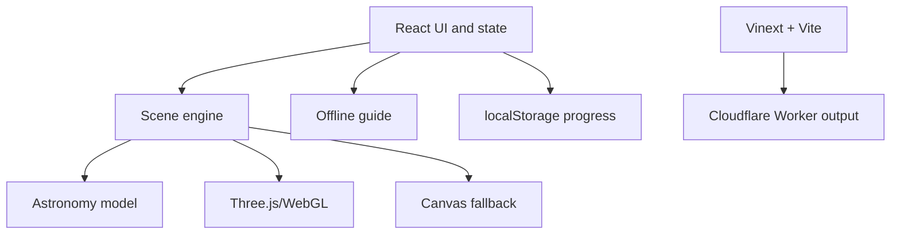
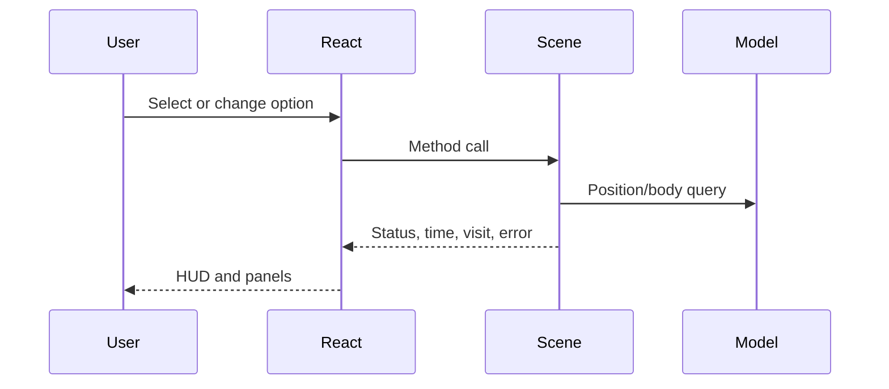

# Solar System Explorer — Architecture

## Scope

This document explains the current V1.1 implementation. Future aspirations belong in [MASTER_SPEC.md](MASTER_SPEC.md); scientific detail belongs in [ASTRONOMY_DATA.md](ASTRONOMY_DATA.md).

## System overview

Solar System Explorer is currently a client-focused React application with an imperative simulation/rendering engine behind a responsive HUD. It has no active application database, authentication, analytics, paid API, or server-side product API.

## Frontend architecture

### React interface

`app/page.tsx` is the main client component. It owns:

- selected body;
- readiness, renderer compatibility, status, errors, and displayed time;
- active sheet/search state;
- compact mobile HUD, flight-control visibility, and distraction-free visibility state;
- view/simulation options;
- distance-comparison selection;
- guide question/answer state;
- visited-world hydration and persistence.

It creates the scene engine once after mounting the canvas host and communicates through method calls and callbacks. High-frequency frame state stays outside React.

Existing Shadcn-derived primitives provide sheets, command search, selects, and switches. `app/globals.css` provides the product-specific HUD and responsive behavior.

At widths up to 760 px, React keeps the same selection/options/scene state but presents it through progressive disclosure: a compact destination dock, an optional touch-flight cluster, and a bottom `Sheet` containing the deeper actions and the same scale controls. Hiding the mobile HUD is presentation-only and never pauses or rewrites the engine.

### Scene adapter boundary

`createScene()` in `app/scene.ts` receives callbacks for selected body, flight/status text, simulation time, visited body, and recoverable scene errors.

It returns an imperative API: `focus`, `preload`, `overview`, `brake`, `setMovement`, `setOptions`, and `dispose`. Preserve this React/engine boundary unless a demonstrated limitation requires change.

## 3D and rendering architecture

### WebGL path

The engine attempts WebGL2, then WebGL. When successful it creates a `THREE.WebGLRenderer` with logarithmic depth, antialiasing, capped device pixel ratio, sRGB output, ACES Filmic tone mapping, a point light at the Sun, and low ambient light.

Each body uses a `THREE.Group` positioned by the astronomy model. Its visible mesh is a textured sphere. Earth adds a cloud sphere and atmosphere shader; Saturn adds a ring mesh. A separate group holds orbit lines. World labels are DOM buttons projected into screen space.

`OrbitControls` handles orbit/pan/zoom and damping. Raycasting handles clicking visible body meshes.

### Canvas compatibility path

If WebGL cannot be created, `app/software-renderer.ts` uses the same camera-relative Three.js scene graph but draws into Canvas 2D. It projects deterministic stars, traverses body/orbit geometry, samples textures, and approximates lighting, clouds, Earth/Sun glow, and Saturn rings. Rendering is throttled and unchanged camera poses are cached.

This path preserves basic interaction and perspective, not WebGL parity.

### Loading and lifecycle

- Earth and Sun textures preload at startup.
- Other body textures load on demand through `preload()`/focus.
- Texture failures report a recoverable UI message.
- Resize uses `ResizeObserver`.
- `dispose()` cancels the frame, disconnects listeners/observer/controls, removes labels/canvas, and disposes resources.

## Coordinate and scale systems

`app/astronomy.ts` returns Cartesian positions in AU for planets. The Moon is derived from the Earth model position plus a sourced, fixed mean ellipse, explicitly tagged illustrative.

`app/scale.ts` is the only presentation-scale policy. `app/scene.ts` supplies model positions to it:

- **Scientific Scale:** each Cartesian AU component is multiplied by 100, preserving every modeled center-distance ratio.
- **Exploration Scale:** direction is preserved while heliocentric radius becomes `24 × (1 − exp(−r / 0.05)) + 38 × ln(1 + r)`. The function is finite, continuous at the Sun, and monotonic.
- **Satellite placement:** parent position and parent-local offset are transformed separately. The Moon retains its modeled offset in Scientific Scale and a 5-unit local separation in Exploration Scale.

Body display radius is a separate presentation rule in `app/scale.ts`: the Sun is fixed at 5 exploration units; other bodies use a square-root enlargement with a minimum. Scientific Scale uses 5% of those display radii. Neither mode is a literal diameter-and-distance scale.

Physical distance calculations never use visual scene positions.

### Coordinate precision and render origin

- Authoritative astronomy and navigation coordinates remain JavaScript numbers (IEEE-754 doubles).
- `app/render-space.ts` subtracts the camera origin in double precision immediately before each render and restores the authoritative scene afterward.
- Orbit and route vertices retain `Float64Array` source coordinates; only the camera-relative snapshot is written to GPU `Float32Array` buffers.
- Raycasting, labels, travel, collision checks, and focus-following use the restored navigation frame.
- Sun-relative custom shaders receive the rebased Sun position, so day/night meaning survives the origin shift.

This avoids the loss of local detail that occurs when large absolute coordinates are converted directly to GPU floats. It also allows future travel far from the Sun without continuously mutating the scientific model.

### Camera clipping and large catalogues

Camera near/far planes are recalculated from the nearest surface clearance and farthest active object, with a finite render horizon. WebGL uses logarithmic depth; the Canvas renderer applies the same near/far visibility bounds.

Future thousands/millions-body support must keep catalogue storage and rendering separate. Positions remain double-precision model data; spatially selected active tiles are transformed in bounded batches, instanced or point-rendered by importance/zoom, and culled outside the active horizon. The million-record test validates coordinate conversion, not simultaneous million-mesh rendering.

## Navigation and camera

### Assisted travel

`focus()` computes an approach point offset from the selected body's visual position. Non-instant travel follows a quadratic curve from the camera through a raised/outward control point to the approach point. Quintic easing controls progress. Duration is logarithmically related to visual span and clamped to about 2.6–6.5 seconds.

A temporary dashed route line is shown. Arrival enables focused-body following and updates visited progress. Reduced-motion mode travels instantly.

### Manual flight

Keyboard/touch movement writes active codes into a set. Each frame calculates forward/right/up translation. Speed depends on target visual size and camera-to-target distance; Shift applies an 8× multiplier. Arrow keys rotate the view direction. Any manual movement cancels assisted travel and enters free-flight status.

Collision correction keeps the camera outside enlarged visible spheres. It is not spacecraft physics.

### Simulation clock and orbital updates

`app/simulation-clock.ts` is the single clock policy. It anchors simulation milliseconds to `performance.now()` and computes `anchor + elapsed × rate`, so frame duration does not accumulate rounding drift. Changing among pause, 1×, 10×, 100× and 1,000× first settles the old rate, then re-anchors at the same instant; the scene never jumps solely because speed changed. It clamps at the data model's `[1800, 2050)` interval and defaults to real time.

`app/scene.ts` reads the clock and recalculates the ten active body transforms on every animation frame. Camera following uses the focused body's before/after positions so orbit motion does not leave the camera behind. Orbit paths remain static 256-segment approximations and are not rebuilt per frame. React receives time notifications at most twice per second, keeping high-frequency work outside component state. This is inexpensive for ten bodies; future catalogue growth must update only a spatially selected active set, not every stored record.

## State management and data flow

- React `useState` is sufficient for current single-route UI state.
- Scene-local mutable state holds animation, camera, controls, input, textures, and flight.
- The scene-local `SimulationClock` owns authoritative running time; React stores only the displayed snapshot and selected rate.
- `localStorage` stores visited IDs/update time under `solar-explorer-progress-v1`.
- Dynamic imports defer `app/scene.ts` and `app/guide.ts` until needed.

## Object model

`app/data/` is the canonical local science layer: physical quantities, orbital parameters, computed positions, dynamic values and editorial summaries are separate modules. `catalog.ts` joins 32 records by stable ID/parent and supplies validation; quantities have units, provenance, uncertainty and explicit missing reasons. `positions.ts` returns result objects with frame/time/model/quality or an unavailable reason. `dynamic.ts` distinguishes computed distance/light time from missing live observations.

`app/astronomy.ts` retains the ten-body `Body` adapter so existing scene/navigation/scale APIs remain stable. It joins science with `app/body-presentation.ts` and educational metadata rather than maintaining duplicate scientific literals. Sun orbital period is now null. New catalogue entries do not automatically become renderer destinations.

`app/data-provenance.tsx` exposes scientific field sources/reliability in the details sheet. The offline guide uses the same canonical physical values and distance service; historical authored topics live separately in `app/data/guide-education.ts`. See [ASTRONOMY_DATA.md](ASTRONOMY_DATA.md) for source selection, schemas, frame conventions, missing models and import policy.

No runtime external API or new dependency was introduced. Pure position results are calculated on demand; the present 32-record in-memory catalogue is not the future million-body storage strategy. Large datasets require compact indexed tiles and selective metadata loading outside the render loop.

## Backend/API architecture

No product backend/API is active. The Worker delegates requests to Vinext and supports framework image optimization. Dormant database scaffolding/examples and authentication helpers are present from the starter but are not active product features. `.openai/hosting.json` has `d1: null` and `r2: null`.

Future external astronomy/AI services require server-side handling, secrets in hosted environment settings, validation, rate limits, and cost controls.

## Build and deployment

- `npm test` runs the verified production build followed by tests.
- `npm run lint` runs ESLint in the managed Sites environment.
- Standalone `tsc --noEmit` currently reports existing errors in flight narrowing and missing Worker ambient types; the production build is not a substitute for a clean standalone typecheck. See KI-021.
- Vite groups Three.js core/addons but currently still reports a chunk above 500 kB.
- Output is Cloudflare Worker-compatible through the Sites Vite plugin.
- GitHub Actions validates pushes and PRs; it does not deploy.
- Production publication is separate through the existing ChatGPT Sites project.
- Merging source does not automatically change the live Site.

See [docs/DEPLOYMENT.md](docs/DEPLOYMENT.md) for the release procedure.

## Important constraints

- Preserve `.openai/hosting.json` and the existing Site identity.
- Keep calculations separate from rendering and UI.
- Never derive scientific distances from compressed scene coordinates.
- Route every body/orbit presentation position through `app/scale.ts`; do not duplicate scale formulas.
- Keep absolute catalogue/navigation coordinates in doubles and rebase only the active render snapshot.
- Preserve WebGL and Canvas paths unless a replacement is proven across supported devices.
- Preserve reduced motion, touch controls, source links, and local progress.
- Do not expose secrets in browser code.
- Do not activate database/authentication merely because starter files exist.
- Do not eagerly load large catalogues or all high-resolution assets.

## Why this architecture was chosen

- Three.js provides mature browser 3D capability and controls.
- Imperative rendering avoids React work on every frame.
- Pure model functions and a versioned local data layer keep scientific logic testable and presentation-independent.
- A centralized two-scale policy reconciles astronomical magnitude with playable exploration while retaining real measurements.
- Camera-relative rendering and adaptive clipping preserve local precision across large coordinate ranges.
- Compatibility rendering improves reach without blocking the WebGL experience.
- Offline knowledge and local progress keep V1.1 private, inexpensive, and reliable.
- Sites/Worker packaging provides managed deployment without client-side credentials.
