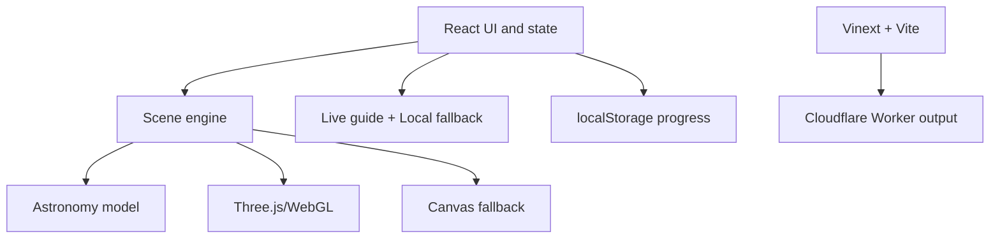
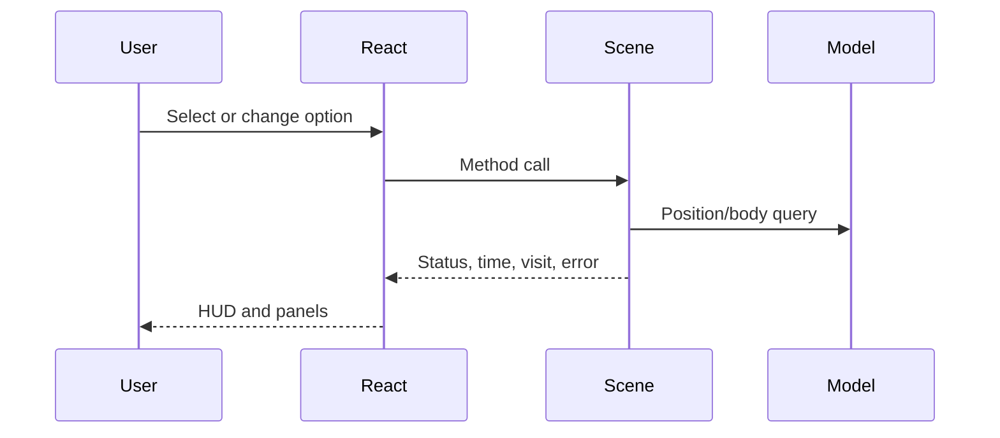

# Solar System Explorer — Architecture

## Scope

This document explains the current V1.1 implementation. Future aspirations belong in [MASTER_SPEC.md](MASTER_SPEC.md); scientific detail belongs in [ASTRONOMY_DATA.md](ASTRONOMY_DATA.md).

## System overview

Solar System Explorer is a client-focused React application with an imperative simulation/rendering engine behind a responsive HUD plus a narrow server-side Astronomy Guide boundary. D1 stores only guide quota/budget reservations; the Worker calls OpenAI and, for explicit freshness-sensitive questions, one allowlisted authoritative science source. There is no product authentication or analytics.

## Frontend architecture

### React interface

`app/page.tsx` is the main client component. It owns:

- selected body;
- readiness, renderer compatibility, status, errors, and displayed time;
- active sheet/search state;
- search query/result/loading state and a separate information-panel object ID;
- compact mobile HUD, flight-control visibility, and distraction-free visibility state;
- view/simulation options;
- distance-comparison selection;
- guide question/answer state;
- visited-world hydration and persistence.

It creates the scene engine once after mounting the canvas host and communicates through method calls and callbacks. High-frequency frame state stays outside React.

Existing Shadcn-derived primitives provide sheets, command search, selects, and switches. `app/globals.css` provides the product-specific HUD and responsive behavior; `app/search.css` isolates the responsive catalogue-result layout.

At widths up to 760 px, React keeps the same selection/options/scene state but presents it through progressive disclosure: a compact destination dock, an optional touch-flight cluster, and a bottom `Sheet` containing the deeper actions and the same scale controls. Hiding the mobile HUD is presentation-only and never pauses or rewrites the engine.

### Scene adapter boundary

`createScene()` in `app/scene.ts` receives callbacks for selected body, flight/status text, simulation time, visited body, and recoverable scene errors.

It returns an imperative API: `focus`, `preload`, `overview`, `brake`, `setMovement`, `setOptions`, and `dispose`. Preserve this React/engine boundary unless a demonstrated limitation requires change.

## 3D and rendering architecture

### WebGL path

The engine attempts WebGL2, then WebGL. When successful it creates a `THREE.WebGLRenderer` with logarithmic depth, antialiasing, capped device pixel ratio, sRGB output, ACES Filmic tone mapping, a point light at the Sun, and low ambient light.

Each active body uses a `THREE.Group` positioned by the astronomy model. Primary bodies and active moons use textured spheres. The shared `BodyDetailManager` keeps Step 19's eight-body close tiers and adds a lightweight 256/1024px identity policy for 21 secondary bodies, with the same total detail-slot budget. Earth adds cloud/night layers; applicable planets and Titan use restrained atmosphere shaders; Saturn adds its ring mesh. Separate groups hold heliocentric planet paths and parent-local moon paths. World labels are DOM buttons projected into screen space. See `docs/VISUAL_IDENTITY.md` and `docs/DESTINATION_READINESS_PASS.md` for coverage and validation limits.

`OrbitControls` handles orbit/pan/zoom and damping. Raycasting handles clicking visible body meshes.

### Canvas compatibility path

If WebGL cannot be created, `app/software-renderer.ts` uses the same camera-relative Three.js scene graph but draws into Canvas 2D. It projects deterministic stars, traverses body/orbit geometry, samples textures, and approximates lighting, clouds, Earth/Sun glow, and Saturn rings. Rendering is throttled and unchanged camera poses are cached.

This path preserves basic interaction and perspective, not WebGL parity.

### Loading and lifecycle

- Earth and Sun textures preload at startup.
- Other body textures load on demand through `preload()`/focus.
- Texture failures report a recoverable UI message.
- Resize uses `ResizeObserver`.
- `dispose()` cancels the frame, disconnects listeners/observer/controls, removes labels/canvas, and disposes resources.

## Coordinate and scale systems

`app/astronomy.ts` returns Cartesian positions in AU for the bounded active set. Planets use the JPL approximation. Moons use a sourced parent-relative J2000 mean ellipse transformed from its published parent-ecliptic, local-Laplace or parent-equatorial reference plane and added to the parent's heliocentric position. All satellite positions are explicitly tagged illustrative.

`app/scale.ts` is the only presentation-scale policy. `app/scene.ts` supplies model positions to it:

- **Scientific Scale:** each Cartesian AU component is multiplied by 100, preserving every modeled center-distance ratio.
- **Exploration Scale:** direction is preserved while heliocentric radius becomes `24 × (1 − exp(−r / 0.05)) + 38 × ln(1 + r)`. The function is finite, continuous at the Sun, and monotonic.
- **Satellite placement:** parent position and parent-local offset are transformed separately. Scientific Scale keeps exact modeled separation. Exploration Scale applies a centralized monotonic radial power compression inside each parent system, preserving direction, phase and orbit ordering rather than implying literal distance.

Moon orbit lines use 96 local vertices and follow the moving parent. Only the focused moon system is visible/raycastable/collidable at a time; the Canvas renderer also traverses visible nodes only. This bounds scene work and label clutter while keeping all 29 destinations searchable and travelable.

Body display radius is a separate presentation rule in `app/scale.ts`: the Sun is fixed at 5 exploration units; other bodies use a square-root enlargement with a minimum. Scientific Scale uses 5% of those display radii. Neither mode is a literal diameter-and-distance scale.

Physical distance calculations never use visual scene positions.

### Coordinate precision and render origin

- Authoritative astronomy and navigation coordinates remain JavaScript numbers (IEEE-754 doubles).
- `app/render-space.ts` subtracts the camera origin in double precision immediately before each render and restores the authoritative scene afterward.
- Orbit and route vertices retain `Float64Array` source coordinates; only the camera-relative snapshot is written to GPU `Float32Array` buffers.
- Raycasting, labels, travel, collision checks, and focus-following use the restored navigation frame.
- Sun-relative custom shaders receive the rebased Sun position, so day/night meaning survives the origin shift.

This avoids the loss of local detail that occurs when large absolute coordinates are converted directly to GPU floats. It also allows future travel far from the Sun without continuously mutating the scientific model.

### Camera clipping and large catalogues

Camera near/far planes are recalculated from the nearest surface clearance and farthest active object, with a finite render horizon. WebGL uses logarithmic depth; the Canvas renderer applies the same near/far visibility bounds.

Future thousands/millions-body support must keep catalogue storage and rendering separate. Positions remain double-precision model data; spatially selected active tiles are transformed in bounded batches, instanced or point-rendered by importance/zoom, and culled outside the active horizon. The million-record test validates coordinate conversion, not simultaneous million-mesh rendering.

## Navigation and camera

### Assisted travel

`focus()` computes an approach point offset from the selected body's visual position. Non-instant travel follows a quadratic curve from the camera through a raised/outward control point to the approach point. Quintic easing controls progress. Duration is logarithmically related to visual span and clamped to about 2.6–6.5 seconds.

A temporary dashed route line is shown. Arrival enables focused-body following and updates visited progress. Reduced-motion mode travels instantly.

### Manual flight

Keyboard/touch movement writes active codes into a set. Each frame calculates forward/right/up translation. Speed depends on target visual size and camera-to-target distance; Shift applies an 8× multiplier. Arrow keys rotate the view direction. Any manual movement cancels assisted travel and enters free-flight status.

`app/navigation-motion.ts` owns the pure motion-response policy. Combined translation axes are normalized, target velocity keeps the established body/distance-aware speed and 8× boost, and exponential response makes acceleration, deceleration and steering stable across frame rates. Releasing input coasts to a short controlled stop; Space/Escape and the explicit brake clear motion immediately. Focus, overview and assisted travel also clear residual manual motion so inertial state cannot leak into automated camera transitions.

Collision correction keeps the camera outside enlarged visible spheres and removes the inward component of manual velocity after contact. It is not spacecraft physics.

### Simulation clock and orbital updates

UI checkpoint A extends the rate union with 86,400 and 2,592,000 seconds/second (explicit timelapse labels). Same clock/clamping/callback boundaries apply. Both renderers now use stronger orbit-material contrast; Canvas no longer caps all path opacity at 0.32. No new scene populations or travel architecture was introduced.

`app/simulation-clock.ts` is the single clock policy. It anchors simulation milliseconds to `performance.now()` and computes `anchor + elapsed × rate`, so frame duration does not accumulate rounding drift. Changing among pause, 1×, 10×, 100× and 1,000× first settles the old rate, then re-anchors at the same instant; the scene never jumps solely because speed changed. It clamps at the data model's `[1800, 2050)` interval and defaults to real time.

`app/scene.ts` reads the clock and recalculates the bounded 29-body active set on every animation frame. Camera following uses the focused body's before/after positions so orbit motion does not leave the camera behind. Planet paths are static 256-segment approximations; 96-segment moon paths are local to and move with their parent. React receives time notifications at most twice per second, keeping high-frequency work outside component state. Only the focused moon system is visible, and future catalogue growth must still update a spatially selected active set rather than every stored record.

## State management and data flow

- React `useState` is sufficient for current single-route UI state.
- Scene-local mutable state holds animation, camera, controls, input, textures, and flight.
- The scene-local `SimulationClock` owns authoritative running time; React stores only the displayed snapshot and selected rate.
- `localStorage` stores visited IDs/update time under `solar-explorer-progress-v1`.
- Dynamic imports defer `app/scene.ts`, `app/guide.ts`, and the search provider until needed.

## Object model

`app/data/` is the canonical local science layer: physical quantities, orbital parameters, computed positions, dynamic values and editorial summaries are separate modules. `catalog.ts` joins 32 records by stable ID/parent and supplies validation; quantities have units, provenance, uncertainty and explicit missing reasons. `positions.ts` returns result objects with frame/time/model/quality or an unavailable reason. `dynamic.ts` distinguishes computed distance/light time from missing live observations.

`app/astronomy.ts` retains the `Body` adapter so existing scene/navigation/scale APIs remain stable. It joins the explicit `app/body-presentation.ts` active set with science and educational metadata rather than maintaining duplicate scientific literals. Adding a catalogue record still does not automatically create a renderer destination.

`app/object-information.tsx` is the presentation adapter for the details sheet. `buildObjectInformation()` composes a catalogue body, the active-scene adapter when present and separately stored educational content into an ordered `ObjectInformationModel`; only applicable, non-null fields are emitted. The renderer accepts that model directly, so future asteroid, comet and spacecraft adapters can reuse it without adding object-specific branches to `page.tsx`. `app/data/object-education.ts` holds the reviewed qualitative composition, discovery and scientific-importance layer.

`app/data-provenance.tsx` exposes scientific field sources/reliability for displayed numerical values and filters unavailable rows by the same omission rule. The offline guide uses the same canonical physical values and distance service; historical authored topics live separately in `app/data/guide-education.ts`. See [ASTRONOMY_DATA.md](ASTRONOMY_DATA.md) for source selection, schemas, frame conventions, missing models and import policy.

`app/distance-comparison.tsx` owns target ordering, unit presentation and the view model for distance results. Body-to-body results call `calculateDistance()` in the canonical dynamic layer at the displayed simulation time. A semimajor-axis “average orbital distance” appears only for a direct parent–child relationship and is never substituted for current separation. Unavailable position models remain unavailable.

`app/search.ts` defines the bounded asynchronous `CatalogSearchProvider` contract and its current local adapter. It normalizes case, diacritics and punctuation, then ranks exact name, exact alias, prefix and all-term type/context matches. Responses expose only compact result records plus `total`/`hasMore`; the UI asks for 20 and the provider hard-caps requests at 50. React keeps `selected` (the active 3D destination) separate from `detailsId` (the object being inspected), so a data-only result cannot enter scene/navigation state. A future server/index provider must implement the same top-k contract with pagination/cursors and detail-on-demand; it must not send the full minor-body catalogue to the browser.

The scene API exposes `getSpacecraftDistance(id)` as a read-only snapshot rather than leaking the Three.js camera into React. Under Scientific Scale, its linear 100-units/AU transform is inverted exactly. Exploration Scale has no single scientific inverse because it combines heliocentric compression, parent-local placement and enlarged bodies, so the estimate is anchored to the currently focused body's model position and physical-radius/display-radius ratio. The UI labels this as a navigation estimate; it is not part of the canonical ephemeris.

No runtime external API or new dependency was introduced. Pure position results are calculated on demand; the present 32-record in-memory catalogue is not the future million-body storage strategy. Large datasets require compact indexed tiles and selective metadata loading outside the render loop.

## Backend/API architecture

Step 16: `guide-context.ts` consumes the scene's read-only `getGuideNavigation()` snapshot; `guide-assistant.ts` separates local explanation from typed evidence/citations. The UI retains answer subject/time independently of current selection.

Pre-Step-20 cleanup: `app/local-guide-presets.ts` derives deterministic preset buttons from the selected catalogue record, available rotation/orbit data and reviewed topic coverage. `page.tsx` still calls `answerContextGuide()` directly for every preset, so this filtering introduces no server request, D1 reservation, external retrieval or Live AI cost. Technical snapshot semantics remain in structured evidence under Sources & data while the lead answer is user-facing.

Step 17: `app/guide-client.ts` submits the captured snapshot to `POST /api/guide`. `worker/guide/endpoint.ts` validates it, rebuilds canonical context/evidence, resolves contextual references, reserves quota through `worker/guide/limits.ts`, and makes one bounded `gpt-5.6-luna` Responses API call. Strict evidence-ID output validation keeps provider prose separate from trusted measurements and citations. Every provider, validation, timeout, network, quota or budget failure returns the deterministic Local guide.

Step 18: `worker/guide/authoritative-sources.ts` detects freshness-sensitive mission/current questions and selects a canonical URL from a fixed official-source registry. Only after D1 reservation, the Worker may retrieve one NASA/ESA/JPL/USGS page under fixed timeout/byte/excerpt limits. Retrieved evidence is typed separately, includes the actual URL and retrieval time, and never modifies canonical data. The model can return only supplied citation IDs; URL text is rejected. Typed source conflicts are disclosed while the project value remains authoritative.

The Worker still delegates application rendering to Vinext and supports framework image optimization. D1 binding `DB` stores only guide request/budget accounting through `0000_guide_limits.sql`; R2 remains disabled. `OPENAI_API_KEY` is a server-only Sites secret. No authentication, analytics or runtime astronomy API is active. See `docs/AI_GUIDE.md` for the exact limits and trust boundary.

## Build and deployment

- `npm test` runs the verified production build followed by tests.
- `npm run lint` runs ESLint in the managed Sites environment.
- Standalone `tsc --noEmit` currently reports existing errors in flight narrowing and missing Worker ambient types; the production build is not a substitute for a clean standalone typecheck. See KI-021.
- Vite groups Three.js core/addons but currently still reports a chunk above 500 kB.
- Output is Cloudflare Worker-compatible through the Sites Vite plugin.
- GitHub Actions validates pushes and PRs; it does not deploy.
- Production publication is separate through the existing ChatGPT Sites project.
- Merging source does not automatically change the live Site.

See [docs/DEPLOYMENT.md](docs/DEPLOYMENT.md) for the release procedure.

## Important constraints

- Preserve `.openai/hosting.json` and the existing Site identity.
- Keep calculations separate from rendering and UI.
- Never derive scientific distances from compressed scene coordinates.
- Keep object-information composition in the reusable presenter; do not reintroduce hard-coded planet facts in `page.tsx` or substitute defaults for missing values.
- Keep body distances in the dynamic science layer and spacecraft-camera conversion behind the scene API. Never present an Exploration Scale spacecraft estimate as a measured or ephemeris position.
- Route every body/orbit presentation position through `app/scale.ts`; do not duplicate scale formulas.
- Keep absolute catalogue/navigation coordinates in doubles and rebase only the active render snapshot.
- Preserve WebGL and Canvas paths unless a replacement is proven across supported devices.
- Preserve reduced motion, touch controls, source links, and local progress.
- Do not expose secrets in browser code.
- Do not activate database/authentication merely because starter files exist.
- Do not eagerly load large catalogues or all high-resolution assets. Preserve the bounded search-provider boundary; future results must come from an indexed server/tile source rather than a browser-resident full catalogue.

## Why this architecture was chosen

- Three.js provides mature browser 3D capability and controls.
- Imperative rendering avoids React work on every frame.
- Pure model functions and a versioned local data layer keep scientific logic testable and presentation-independent.
- A centralized two-scale policy reconciles astronomical magnitude with playable exploration while retaining real measurements.
- Camera-relative rendering and adaptive clipping preserve local precision across large coordinate ranges.
- Compatibility rendering improves reach without blocking the WebGL experience.
- Offline knowledge and local progress keep V1.1 private, inexpensive, and reliable.
- Sites/Worker packaging provides managed deployment without client-side credentials.

## Step 14 — Bounded minor-body provider

The core 32-body science model now has 32 destinations. Minor bodies use a separate asynchronous provider (`app/minor-bodies.ts`), accessed through the existing search dialog and a compact sheet. No physical catalogue is imported into the client bundle.

- Storage: versioned same-origin JSON pages in `public/catalogue/v1/`: `search/<normalized_prefix>/<page>`, `browse/<collection>/<page>`, `shells/<log2_AU_shell>/<page>`, and individual `objects/<stable_spk_id>`. A tiny manifest describes the edition. Raw snapshots stay in source control outside public assets. Builds do not call JPL.
- Loading: explicit pages of 32 compact summaries, then details only on demand. LRU holds 64 responses; each response is capped at 128 KiB before parsing. Debounced queries ignore superseded UI responses. Search pages rank by curated importance, a presentation priority independent of hazard or scientific reliability.
- Spatial filtering: conservative perihelion/aphelion overlap against logarithmic radial shells selects candidates; at most 64 candidates receive exact uncompressed two-body position/distance checks. Queries that exhaust budgets or exceed indexed radial coverage disclose incomplete results. UI exposes a timestamped 1-AU neighborhood of simulated Earth; provider accepts arbitrary centers/radii.
- Rendering: only Show/Travel activates a marker. At most 12 low-poly markers; lowest-importance retained entry is evicted when full. Unselected markers disappear beyond 160 visual units; selected markers have a finite horizon and a single label. Exactly one selected object may stream a compact source-derived shape or disclosed procedural approximation; switching/clear/eviction/unmount aborts and disposes it. All active positions use the existing scale and camera-relative render pipeline; clipping includes visible markers. No comet tails or global orbit-line clouds are invented.
- Navigation: minor focus is a separate scene target with motion following and optional eased approach. Manual flight/primary focus cancels minor following. The selected minor body receives its own compact card/mobile summary; primary visited counters remain for the core worlds. Minor selection does not mutate canonical planet identities.

### Growth path and constraints

The browser contract scales independently of catalogue size, but the sample generator and static-asset deployment are not a million-record ingestion/hosting solution. Before a bulk import, replace the in-memory generator with streaming ingestion plus external sort, store object pages in object storage, and serve the same bounded contracts through a server index. Use a compact prefix trie/FTS rather than materializing every prefix as a separate hosted file. Partition spatial candidates using conservative 3D time-bucket envelopes and track epoch validity; retain radial shells as a broad phase. Dense-cell queries must remain paginated or explicitly incomplete. Test cold-cache latency, transfer bytes, heap and frame time at increasing catalogue sizes before increasing any rendering budget. Future mesh/point instancing and detailed shape assets remain bounded LOD tiers, never one mesh per catalogue record.

## Step 15 — Statistical population regions

`app/populations.ts` owns deterministic renderer-only samples in heliocentric scene-axis AU. Main-belt and Kuiper samples are simplified axisymmetric envelopes; Trojan samples are broad clouds centered approximately ±60° from Jupiter's uncompressed model longitude. `app/scene.ts` projects every sample independently through the centralized scale transform and updates the Trojan anchor at a low simulated-time cadence.

The layer is limited to four `THREE.Points` draws and 1,100 one-pixel markers. It does not alter the canonical catalogue, minor-body provider, search, raycasting, collision, distance, travel or visit systems. `worldPointGeometry()` extends the camera-relative Float64-to-Float32 snapshot boundary; point containers are not translated a second time. The Canvas renderer draws the same bounded markers and includes visibility/buffer state in its render cache signature.

The compatibility renderer normally rasterizes body spheres at 128 × 128. A close Saturn presentation switches only that sphere to a bounded 256 × 256 raster to prevent magnified terminator stair-stepping without multiplying the cost of every visible body.

## Step 19 implementation checkpoint — shared body detail

`app/body-lod.ts` centralizes projected-pixel thresholds, hysteresis, tiers and atmospheric profiles. `app/body-detail.ts` streams same-origin map bundles into existing meshes, blends texture uniforms, upgrades/restores sphere geometry, prioritizes visible focus, and disposes evicted/aborted resources. At most two desktop or one mobile/Canvas detail bundles remain allocated; seven small bases can remain cached. Existing scale, navigation, astronomy and AI boundaries are unchanged. Canvas shares the LOD state and drops decoded texture pixels on disposal. `data-detail` and `data-render-stats` expose non-sensitive renderer diagnostics. Step 19’s owner real mobile/WebGL acceptance is recorded in `docs/STEP_19_CHECKPOINT.md`.

`app/shadow-policy.ts` separates direct material lighting from shadow-map participation. Enlarged illustrative moons do not cast or receive eclipse shadows. Planet surfaces cast only onto opted-in receivers and do not receive coarse moon/ring/self shadows. Saturn's ring receives Saturn's shadow but does not cast its simplified alpha sheet onto the planet.
