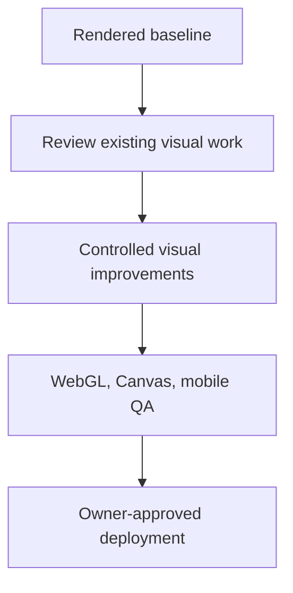

# Solar System Explorer — Roadmap

## Roadmap rules

- Preserve a working, deployable baseline.
- Improve the experience before dramatically expanding object count.
- Each visual/control milestone requires rendered inspection, relevant tests, and explicit deployment approval.
- Deferred vision items are not commitments for the next release.

## Completed milestones

### V1 — First playable prototype

Status: completed in `719e8cd`.

- Ten-body scene, Earth start, selection, search, destination strip, details, and distance comparison.
- Manual flight, assisted travel, orbits, time controls, offline guide, and initial WebGL/Canvas renderers.

### V1 stabilization

Status: completed in `fa6a107`.

- Control and compatibility-renderer corrections.
- Layering/readability and safer scene behavior.

### V1.1 — Mobile, persistence, and repository baseline

Status: completed through `2582807`, `acf79e7`, `89d24cd`, and the permanent-document/checkpoint commits that follow them.

- Mobile touch controls and responsive improvements.
- Visited-world persistence/reset and expanded offline guide.
- Compatibility/build improvements.
- CI and durable project documentation.
- Build, lint, and 8 tests verified on 2026-09-09.

## Current milestone

### VISUAL PASS #1

Status: planned; implementation has not begun.

1. Establish rendered baselines for the current WebGL and Canvas paths.
2. Review the undeployed GitHub rendering work in `e8ec19d`; treat it as a work-in-progress, not an accepted milestone.
3. Improve lighting and shadows without obscuring scientifically meaningful day/night orientation.
4. Improve the Sun, star field, planet materials, Earth atmosphere/night side, Saturn rings, and orbit lines.
5. Improve camera transitions and arrival framing without changing the product's flight model.
6. Inspect desktop and mobile layouts plus both rendering paths; fix regressions before requesting owner feedback.
7. Keep production unchanged until explicit owner approval.

## Next milestones

### V1.2 — Flight and navigation quality

Provisional; follows VISUAL PASS #1 unless a visual change requires a tightly scoped control/camera correction.

- Navigation regression baseline.
- Smooth non-gamer-friendly manual movement and steering.
- Better assisted-travel choreography and arrival framing.
- Measured bundle/startup optimization where useful.

### V1.3 — Close-approach depth and selected worlds

Provisional; depends on V1.2 quality/performance.

- Explicit LOD strategy.
- Selected objects: Pluto/Charon, Ceres, Galilean moons, Titan, Enceladus.
- Generalized parent-child relationships and object-type panels.
- Better label crowding and nearby-object discovery.

### V1.4 — Search, time, and learning depth

Provisional; depends on generalized data schemas.

- Aliases and richer/natural-language catalogue search.
- Selectable dates and documented accuracy.
- Guided tours and stronger provenance display.

### V2 — Grounded AI astronomy guide

Provisional; depends on trustworthy structured data and approved cost/privacy design.

- Context-aware conversation using selected body, date, and spacecraft context.
- Structured/curated retrieval, citations, and uncertainty handling.
- Server-side API boundary, secrets, rate limits, monitoring, and cost limits.
- Useful offline/fallback experience.

### Later systems

- Missions, achievements, exploration logs, and completion tracking.
- Spacecraft/probe routes and optional sound.
- Non-programmer admin tools and privacy-conscious analytics.
- Optional accounts/synchronization.

## Deferred items

- Full minor-body simultaneous rendering, multiplayer, massive admin, terrain landing, navigation-grade spacecraft physics, research-grade default ephemerides, exoplanets, nearby stars, Milky Way, VR, classroom mode, and user-created missions.

## Dependency notes

- Catalogue growth depends on separating scientific, editorial, and rendering schemas.
- Natural-language search/AI depend on source-provenance metadata.
- Cloud progress/accounts depend on identity, privacy, database, and cost decisions.
- High-detail worlds depend on performance budgets, LOD, streaming, and device tests.
- Wider date accuracy depends on a verified ephemeris/time-standard strategy.
- Deployment depends on build/tests, relevant visual QA, and owner approval.
