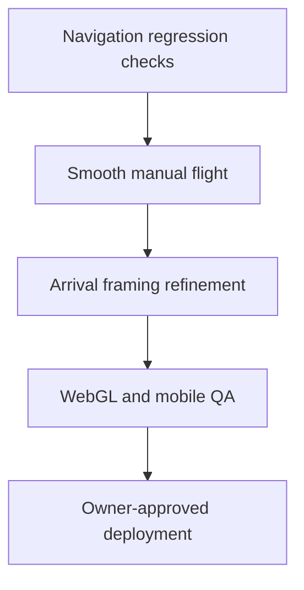

# Solar System Explorer — Roadmap

## Roadmap rules

- Preserve a working, deployable baseline.
- Improve the experience before dramatically expanding object count.
- Each visual/control milestone requires rendered inspection, relevant tests, and explicit deployment approval.
- Deferred vision items are not commitments for the next release.

### Milestone-close protocol

Before work begins on the next substantial milestone:

1. Review the implementation, tests, and rendered behavior changed by the completed milestone.
2. Update only the affected permanent project documents; preserve history and unresolved issues.
3. Keep `PROJECT_STATE.md` concise and current, and point this roadmap at the next milestone.
4. Create and push a stable repository checkpoint when repository access is available.
5. Report which documents changed, the next milestone, and whether a fresh Work chat can continue safely.

## Completed milestones

### V1 — First playable prototype

Status: completed in `719e8cd`.

- Ten-body scene, Earth start, selection, search, destination strip, details, and distance comparison.
- Manual flight, assisted travel, orbits, time controls, offline guide, and initial WebGL/Canvas renderers.

### V1 stabilization

Status: completed in `fa6a107`.

- Control and compatibility-renderer corrections.
- Layering/readability and safer scene behavior.

### V1.1 — Mobile, persistence, and repository baseline

Status: completed through `2582807`, `acf79e7`, `89d24cd`, and the permanent-document/checkpoint commits that follow them.

- Mobile touch controls and responsive improvements.
- Visited-world persistence/reset and expanded offline guide.
- Compatibility/build improvements.
- CI and durable project documentation.
- Build, lint, and 8 tests verified on 2026-09-09.

### VISUAL PASS #1

Status: completed and published on 2026-09-09.

- Physically based planet materials, stronger directional light-dark separation, restrained ambient fill, and soft WebGL shadows.
- Layered Sun corona, varied deterministic stars, Earth night lights/day-weighted atmosphere, and improved Saturn rings.
- Muted contextual orbit lines and eased assisted/system-view camera transitions.
- Canvas parity improvements for background, terminators, night lights, rings, glows, and overview framing.
- Production build, lint, and 9 tests passed.
- Desktop compatibility rendering inspected for Earth, Sun, Saturn, system overview, travel, and layout; cropped overview and ring faceting were corrected.
- WebGL and physical-device mobile inspection remain required before release confidence is complete.

### SCALE ARCHITECTURE PASS

Status: completed and published on 2026-09-09.

- Centralized Scientific Scale and Exploration Scale presentation transforms.
- Preserved uncompressed astronomy values independently of rendering.
- Added parent-local satellite placement, camera-relative rendering, double-precision orbit/route sources, adaptive clipping, and logarithmic WebGL depth.
- Defined bounded spatial streaming/instancing as the path to thousands or millions of catalogue objects.
- Build and lint passed; all 16 tests passed, including a synthetic million-record coordinate conversion.
- Compatibility gameplay inspection passed scale switching, invariant measurements, travel/arrival, braking, overview, manual flight, and recovery.
- WebGL validation remains part of V1.2 QA.

### MOBILE HUD PASS

Status: completed and published on 2026-09-09.

- Replaced the obstructive mobile overlay stack with a compact header, icon-only view tools, and selected-world dock.
- Added one unified bottom action sheet with travel, details, flight, overview, focus, guide, settings, and scale selection.
- Made touch flight controls optional and added a distraction-free hide/restore mode.
- Preserved the desktop HUD, React/scene boundary, navigation system, and scientific data/scale rules.
- Build/lint and all 17 tests passed; rendered compatibility QA covered 390 × 844 closed/open/flight/hidden states and desktop preservation.
- Physical-device and full-WebGL validation remain in V1.2.

### Step 8 — AUTHORITATIVE ASTRONOMICAL DATA

Status: initial data layer completed and published on 2026-09-10 (public Site version 6).

- Local versioned 32-body catalogue: Sun, eight planets, 21 selected major moons, Ceres and Pluto.
- Separate scientific quantities, orbital elements, calculated positions, dynamic observations, editorial content and presentation metadata.
- JPL/NASA/IAU sources, field-level units/provenance/uncertainty, explicit missing values and source/reliability UI.
- Existing ten destinations read canonical data; the Moon now has a sourced mean starting ellipse and an explicit illustrative accuracy limit.
- New-body rendering, precision lunar ephemerides and unimported Ceres/Pluto positions remain future work, not silently completed features.
- No runtime astronomy API, paid usage or new dependency.
- Production build, lint and 23 tests pass. Standalone typecheck issues outside the new modules are recorded as KI-021; prior WebGL/device QA gaps remain open.

### REAL ORBITAL POSITIONS

Status: completed and published on 2026-09-10 (checkpoint `7c719ab`, public Site version 7).

- Added a monotonic UTC simulation clock with pause, real time, 10×, 100× and 1,000×.
- Existing JPL 1800–2050 planet elements now drive continuous per-frame positions; focused-body following remains stable as worlds move.
- Added JPL's published nominal fit-error metadata and in-product disclosure. The Sun remains the heliocentric origin; the Moon remains illustrative rather than falsely upgraded.
- Kept orbit polylines static and React time updates at 2 Hz while positions animate per frame.
- Production build, lint and all 28 tests pass. Automated clock/orbit integration checks were added; current-environment rendered browser inspection was unavailable, so physical-device and full-WebGL QA remain open.

### Step 10 — OBJECT INFORMATION SYSTEM

Status: completed and published on 2026-09-13 (checkpoint `64cbdf8`, public Site version 8).

- Replaced the planet-specific details markup with a reusable, type-aware information model and renderer.
- Current destinations show applicable canonical radius, diameter, mass, gravity, orbital period and rotation values plus separately stored atmosphere, composition, temperature, discovery, scientific importance and interesting-fact content.
- Missing and inapplicable values are omitted from both the panel and provenance disclosure; no display defaults are invented.
- Added asteroid, comet and spacecraft category support at the model boundary and a generic spacecraft rendering regression without prematurely adding those objects to the scene.
- Production build, lint and all 30 tests pass.

### Step 11 — DISTANCE CALCULATOR

Status: completed and published on 2026-09-13 (checkpoint `91515d5`, public Site version 9).

- Added contextual comparison targets for Earth, Sun, applicable parent body, spacecraft and every other active destination.
- Body-to-body values use simultaneous calculated positions at the displayed simulation time and expose their UTC timestamp and model limitation.
- Direct parent–child pairs show the semimajor axis separately as “Average orbital distance”; it never replaces instantaneous separation.
- Added magnitude-aware km, million-km and AU formatting plus explicit unavailable states.
- Added a read-only spacecraft-distance scene boundary: exact in Scientific Scale and explicitly estimated in compressed Exploration Scale.
- Production build, lint and all 32 tests pass.

### Step 12 — SEARCH SYSTEM

Status: completed and published on 2026-09-13 (checkpoint `1363df3`, public Site version 10).

- Searches all 32 local catalogue records using canonical names, curated aliases, object type and parent/location context; exact name/alias matches rank first.
- Every result presents Show, Travel to and Information. Show/travel are enabled only for the ten validated scene destinations; all 32 can open the reusable information panel.
- Separates the information-panel ID from active 3D selection, preventing data-only records from entering navigation state.
- Adds a lazy-loaded asynchronous provider contract with 20-result UI requests and a 50-result hard cap. A future indexed server adapter can replace the local implementation without loading a million-object catalogue in browser memory.
- Production build, lint and all 34 tests pass.

### Step 13 — ADD MAJOR MOONS

Status: completed on 2026-09-14; stable checkpoint/public deployment recorded in the repository and Sites version history.

- Activated 19 additional moons around Mars, Jupiter, Saturn, Uranus and Neptune, bringing the bounded scene to 29 destinations while retaining all 32 catalogue records.
- Added JPL-frame-aware parent-relative mean-orbit propagation, including IAU/NAIF Uranus pole orientation, with explicit illustrative quality and no claimed ephemeris error bound.
- Added lightweight moon materials, lower-detail geometry, 96-segment parent-local orbit paths, and focused-system visibility culling across WebGL, Canvas, labels, raycasting and collision checks.
- Added NASA-reviewed descriptions, facts, atmospheres, composition, discovery and scientific-importance content for the major moons and Charon.
- Kept Charon information-only because Pluto has no validated heliocentric position; no fallback was invented.
- Production build and all 36 tests pass; desktop compatibility-renderer search/focus/orbit/information QA found no application console errors.

### Step 14 — ASTEROID AND COMET SYSTEM

Implemented: 19-object JPL snapshot, offline importer, paged prefix/alias/category indexes, detail-on-demand LRU, conservative spatial filtering with exact model distance, timestamped Nearby Earth, importance ranking, capped marker activation/eviction, visibility LOD and Show/Travel. Final production build, lint and all 40 tests passed. Desktop compatibility QA passed; published as public Site version 12. Full WebGL/physical-device mobile QA remains open.

Deferred scaling work: bulk streaming import, object-storage deployment, fine 3D time-valid spatial indexes, million-record end-to-end benchmarks and detailed shape/point-instancing tiers. The current browser workload is bounded; large-catalogue throughput has not been measured.

### Step 15 — ASTEROID BELT AND KUIPER BELT VISUALIZATION

Status: implemented and verified in source on 2026-09-14.

- Four deterministic, renderer-only point regions: main asteroid belt (2.1–3.3 AU), Kuiper Belt (30–50 AU), and Jupiter Trojan L4/L5 regions centered approximately 60° ahead/behind Jupiter. A dedicated Small-body regions overview fits the full Kuiper envelope in both scales.
- 1,100 total representative one-pixel markers across four draw calls. They are never catalogue records, object counts, destinations, raycast targets or distance inputs.
- Both scale modes project each AU sample through `app/scale.ts`; camera-relative Float64-backed point buffers preserve precision. WebGL and Canvas paths are supported.
- The Settings switch and visible accessible legend disclose that marker size and density are greatly enhanced and positions are illustrative.
- Build, lint and 52 automated sampling/projection/render/UI checks pass. Full WebGL and physical-device appearance/performance remain in the V1.2 QA plan.

## Next recommended milestone

### Step 16 — AI astronomy guide foundation

Implemented free local context/evidence prototype with bounded nearby objects, coordinate caveats, timestamped answers, source cards and a future provider contract. Paid LLM integration remains gated; see `docs/AI_GUIDE.md`. Do not describe this prototype as a connected generative AI. V1.2 physical-device validation remains open and is not superseded.

Verification: production build, lint and 59 automated tests pass. New guide browser/device interaction QA is not yet recorded. Next: inspect the prototype in use, then decide whether to authorize a paid provider after current pricing and hard-budget safeguards are established.

### V1.2 — Flight and navigation quality

Status: in progress.

1. Completed in source: navigation regressions protect focus, overview, travel, braking, cancellation and reduced motion.
2. Completed in source: smooth frame-rate-independent acceleration, deceleration and steering; normalized combined axes; retained distance-aware speed/direct control and immediate brake.
3. Refine body-aware assisted arrival framing where VISUAL PASS #1 QA shows a need.
4. Complete WebGL and physical-device mobile visual/interaction QA.
5. Measure bundle/startup, population-layer frame cost and WebGL shadow cost; optimize only where evidence supports it.

Planned sequence: complete assisted-arrival matrix first; run desktop/mobile WebGL and physical touch/keyboard QA second; profile startup/chunk/shadow/population cost third; then address only evidenced failures and close V1.2 with a stable checkpoint.

The current source passes the production build, lint and all 51 automated tests. It is not considered fully validated for control feel or population appearance until physical keyboard/touch-device and full-WebGL QA are complete.

## Next milestones

### V1.3 — Close-approach depth and dwarf planets

Provisional; depends on V1.2 quality/performance and validated local position models for the now-catalogued bodies.

- Explicit LOD strategy.
- Validate/import local Ceres and Pluto positions, then enable Pluto/Charon and Ceres only when their parent/heliocentric models are complete.
- Add selected high-value moon textures/close-approach detail only where asset provenance and measured performance justify them.
- Better label crowding and nearby-object discovery.

### V1.4 — Catalogue, time, and learning depth

Provisional; depends on generalized data schemas.

- Server-indexed/paginated catalogue ingestion and optional natural-language query interpretation above the bounded search-provider contract.
- Selectable dates and documented accuracy.
- Guided tours and stronger provenance display.

### V2 — Grounded AI astronomy guide

Provisional; depends on trustworthy structured data and approved cost/privacy design.

- Context-aware conversation using selected body, date, and spacecraft context.
- Structured/curated retrieval, citations, and uncertainty handling.
- Server-side API boundary, secrets, rate limits, monitoring, and cost limits.
- Useful offline/fallback experience.

### Later systems

- Missions, achievements, exploration logs, and completion tracking.
- Spacecraft/probe routes and optional sound.
- Non-programmer admin tools and privacy-conscious analytics.
- Optional accounts/synchronization.

## Deferred items

- Full minor-body simultaneous rendering, multiplayer, massive admin, terrain landing, navigation-grade spacecraft physics, research-grade default ephemerides, exoplanets, nearby stars, Milky Way, VR, classroom mode, and user-created missions.

## Dependency notes

- Step 8 completed the initial schema separation. Catalogue/rendering growth now depends on validated ephemerides, frame conversions, source review and bounded ingestion/streaming.
- Natural-language search/AI depend on source-provenance metadata.
- Cloud progress/accounts depend on identity, privacy, database, and cost decisions.
- High-detail worlds depend on performance budgets, LOD, streaming, and device tests.
- Wider date accuracy depends on a verified ephemeris/time-standard strategy.
- Deployment depends on build/tests, relevant visual QA, and owner approval.
