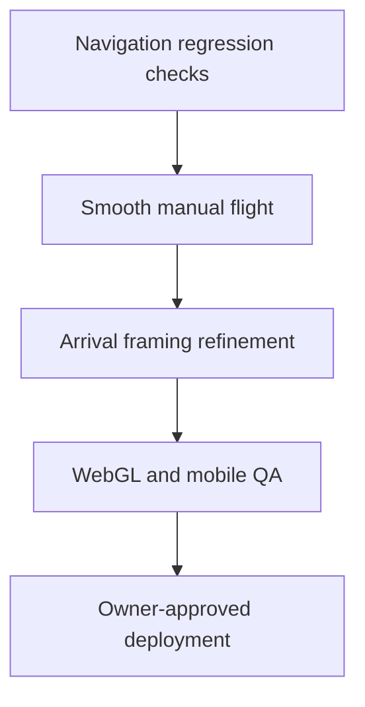

# Solar System Explorer — Roadmap

## Roadmap rules

- Preserve a working, deployable baseline.
- Improve the experience before dramatically expanding object count.
- Each visual/control milestone requires rendered inspection, relevant tests, and explicit deployment approval.
- Deferred vision items are not commitments for the next release.

### Milestone-close protocol

Before work begins on the next substantial milestone:

1. Review the implementation, tests, and rendered behavior changed by the completed milestone.
2. Update only the affected permanent project documents; preserve history and unresolved issues.
3. Keep `PROJECT_STATE.md` concise and current, and point this roadmap at the next milestone.
4. Create and push a stable repository checkpoint when repository access is available.
5. Report which documents changed, the next milestone, and whether a fresh Work chat can continue safely.

## Completed milestones

### V1 — First playable prototype

Status: completed in `719e8cd`.

- Ten-body scene, Earth start, selection, search, destination strip, details, and distance comparison.
- Manual flight, assisted travel, orbits, time controls, offline guide, and initial WebGL/Canvas renderers.

### V1 stabilization

Status: completed in `fa6a107`.

- Control and compatibility-renderer corrections.
- Layering/readability and safer scene behavior.

### V1.1 — Mobile, persistence, and repository baseline

Status: completed through `2582807`, `acf79e7`, `89d24cd`, and the permanent-document/checkpoint commits that follow them.

- Mobile touch controls and responsive improvements.
- Visited-world persistence/reset and expanded offline guide.
- Compatibility/build improvements.
- CI and durable project documentation.
- Build, lint, and 8 tests verified on 2026-09-09.

### VISUAL PASS #1

Status: completed and published on 2026-09-09.

- Physically based planet materials, stronger directional light-dark separation, restrained ambient fill, and soft WebGL shadows.
- Layered Sun corona, varied deterministic stars, Earth night lights/day-weighted atmosphere, and improved Saturn rings.
- Muted contextual orbit lines and eased assisted/system-view camera transitions.
- Canvas parity improvements for background, terminators, night lights, rings, glows, and overview framing.
- Production build, lint, and 9 tests passed.
- Desktop compatibility rendering inspected for Earth, Sun, Saturn, system overview, travel, and layout; cropped overview and ring faceting were corrected.
- WebGL and physical-device mobile inspection remain required before release confidence is complete.

### SCALE ARCHITECTURE PASS

Status: completed and published on 2026-09-09.

- Centralized Scientific Scale and Exploration Scale presentation transforms.
- Preserved uncompressed astronomy values independently of rendering.
- Added parent-local satellite placement, camera-relative rendering, double-precision orbit/route sources, adaptive clipping, and logarithmic WebGL depth.
- Defined bounded spatial streaming/instancing as the path to thousands or millions of catalogue objects.
- Build and lint passed; all 16 tests passed, including a synthetic million-record coordinate conversion.
- Compatibility gameplay inspection passed scale switching, invariant measurements, travel/arrival, braking, overview, manual flight, and recovery.
- WebGL validation remains part of V1.2 QA.

### MOBILE HUD PASS

Status: completed and published on 2026-09-09.

- Replaced the obstructive mobile overlay stack with a compact header, icon-only view tools, and selected-world dock.
- Added one unified bottom action sheet with travel, details, flight, overview, focus, guide, settings, and scale selection.
- Made touch flight controls optional and added a distraction-free hide/restore mode.
- Preserved the desktop HUD, React/scene boundary, navigation system, and scientific data/scale rules.
- Build/lint and all 17 tests passed; rendered compatibility QA covered 390 × 844 closed/open/flight/hidden states and desktop preservation.
- Physical-device and full-WebGL validation remain in V1.2.

### Step 8 — AUTHORITATIVE ASTRONOMICAL DATA

Status: initial data layer completed and published on 2026-09-10 (public Site version 6).

- Local versioned 32-body catalogue: Sun, eight planets, 21 selected major moons, Ceres and Pluto.
- Separate scientific quantities, orbital elements, calculated positions, dynamic observations, editorial content and presentation metadata.
- JPL/NASA/IAU sources, field-level units/provenance/uncertainty, explicit missing values and source/reliability UI.
- Existing ten destinations read canonical data; the Moon now has a sourced mean starting ellipse and an explicit illustrative accuracy limit.
- New-body rendering, precision lunar ephemerides and unimported Ceres/Pluto positions remain future work, not silently completed features.
- No runtime astronomy API, paid usage or new dependency.
- Production build, lint and 23 tests pass. Standalone typecheck issues outside the new modules are recorded as KI-021; prior WebGL/device QA gaps remain open.

### REAL ORBITAL POSITIONS

Status: completed and published on 2026-09-10 (checkpoint `7c719ab`, public Site version 7).

- Added a monotonic UTC simulation clock with pause, real time, 10×, 100× and 1,000×.
- Existing JPL 1800–2050 planet elements now drive continuous per-frame positions; focused-body following remains stable as worlds move.
- Added JPL's published nominal fit-error metadata and in-product disclosure. The Sun remains the heliocentric origin; the Moon remains illustrative rather than falsely upgraded.
- Kept orbit polylines static and React time updates at 2 Hz while positions animate per frame.
- Production build, lint and all 28 tests pass. Automated clock/orbit integration checks were added; current-environment rendered browser inspection was unavailable, so physical-device and full-WebGL QA remain open.

## Current milestone

### V1.2 — Flight and navigation quality

Status: planned; implementation has not begun.

1. Add navigation regression coverage for focus, overview, travel, braking, cancellation, and reduced motion.
2. Add smooth non-gamer-friendly acceleration, deceleration, and steering without removing direct control.
3. Refine body-aware assisted arrival framing where VISUAL PASS #1 QA shows a need.
4. Complete WebGL and physical-device mobile visual/interaction QA.
5. Measure bundle/startup and WebGL shadow cost; optimize only where evidence supports it.

## Next milestones

### V1.3 — Close-approach depth and selected worlds

Provisional; depends on V1.2 quality/performance and validated local position models for the now-catalogued bodies.

- Explicit LOD strategy.
- Selected objects: Pluto/Charon, Ceres, Galilean moons, Titan, Enceladus.
- Generalized parent-child relationships and object-type panels.
- Better label crowding and nearby-object discovery.

### V1.4 — Search, time, and learning depth

Provisional; depends on generalized data schemas.

- Aliases and richer/natural-language catalogue search.
- Selectable dates and documented accuracy.
- Guided tours and stronger provenance display.

### V2 — Grounded AI astronomy guide

Provisional; depends on trustworthy structured data and approved cost/privacy design.

- Context-aware conversation using selected body, date, and spacecraft context.
- Structured/curated retrieval, citations, and uncertainty handling.
- Server-side API boundary, secrets, rate limits, monitoring, and cost limits.
- Useful offline/fallback experience.

### Later systems

- Missions, achievements, exploration logs, and completion tracking.
- Spacecraft/probe routes and optional sound.
- Non-programmer admin tools and privacy-conscious analytics.
- Optional accounts/synchronization.

## Deferred items

- Full minor-body simultaneous rendering, multiplayer, massive admin, terrain landing, navigation-grade spacecraft physics, research-grade default ephemerides, exoplanets, nearby stars, Milky Way, VR, classroom mode, and user-created missions.

## Dependency notes

- Step 8 completed the initial schema separation. Catalogue/rendering growth now depends on validated ephemerides, frame conversions, source review and bounded ingestion/streaming.
- Natural-language search/AI depend on source-provenance metadata.
- Cloud progress/accounts depend on identity, privacy, database, and cost decisions.
- High-detail worlds depend on performance budgets, LOD, streaming, and device tests.
- Wider date accuracy depends on a verified ephemeris/time-standard strategy.
- Deployment depends on build/tests, relevant visual QA, and owner approval.
