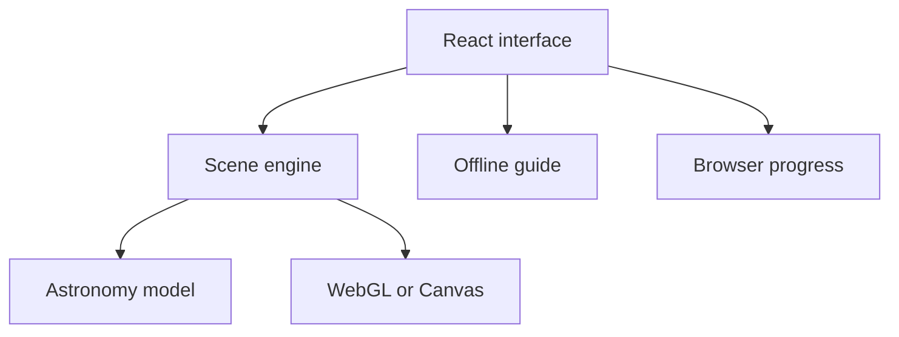

# Architecture

## Overview

Solar System Explorer is a client-focused React application with a simulation engine behind a responsive heads-up display. There is currently no application database or server-side product API.

## Application layers

### Interface and state

`app/page.tsx` owns the selected world, active information panel, view settings, simulation rate, guide prompts, and visited-world state. It creates the scene engine once the canvas container is mounted and passes user choices into that engine.

Visited worlds are persisted to `localStorage` under `solar-explorer-progress-v1`. This data is device- and browser-specific. It is not synchronized, backed up, or associated with an account.

### Scene and controls

`app/scene.ts` builds the Three.js scene graph and owns animation, camera movement, object picking, touch and keyboard flight input, collision avoidance, orbit paths, labels, texture loading, and assisted travel. The React layer receives selection, readiness, compatibility-mode, and flight-status updates through callbacks.

WebGL is selected when the browser can create a WebGL context. Otherwise, `app/software-renderer.ts` draws the same scene and camera through a lower-resolution Canvas 2D ray/sphere renderer. The fallback preserves selection and navigation logic but omits advanced material effects.

### Astronomy model

`app/astronomy.ts` contains the body catalogue and pure position/distance calculations. Planet positions use JPL's approximate Keplerian elements for 1800–2050. UTC is used as a practical approximation to dynamical time, and the model uses the Earth–Moon barycenter as Earth.

The Moon is modeled as a circular 384,400 km orbit with a 27.3217-day period, 5.145-degree inclination, and arbitrary phase. It is intentionally not presented as a lunar ephemeris.

### Guide

`app/guide.ts` answers supported topics from a curated local dataset. It is dynamically imported when needed to keep it out of the initial interaction path. No prompt or user data leaves the browser, and there is no AI usage cost in this version.

### Assets and loading

Surface textures are static files in `public/textures/`. The scene loads them on demand. Three.js scene code is loaded from the client application; the build tool handles production chunking.

## Scientific and visual boundaries

- Exploration mode compresses radial distances while preserving directions.
- Scientific-distance mode preserves relative center positions, but body radii remain enlarged for visibility.
- Distance comparisons use model coordinates rather than visual scene units.
- Assisted travel is a visual curved interpolation, not an orbital transfer calculation.
- Collision avoidance protects the camera from visible spheres; it is not physics.
- Stars are a deterministic decorative field, not a star catalogue.
- Axial orientation, atmosphere effects, lighting, rings, and eclipses are illustrative.
- There is no terrain landing, terrain streaming, spacecraft dynamics, or navigation-grade accuracy.

## Testing strategy

`tests/astronomy.test.mjs` checks coordinate and distance invariants. `tests/ui-components.test.mjs` checks key source-level and guide behaviors. `npm test` first runs the full production build, so broken packaging fails the same command as the automated tests.

Browser and device testing remains necessary for WebGL rendering, pointer behavior, touch gestures, responsiveness, and perceived travel motion.
